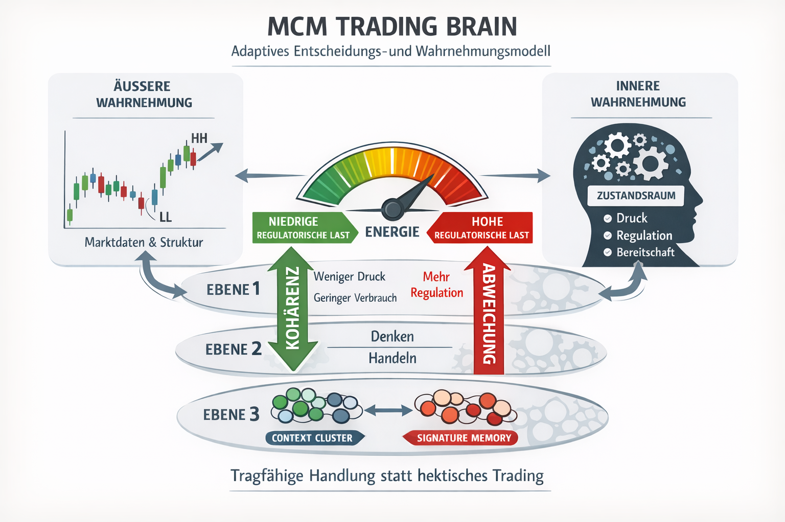
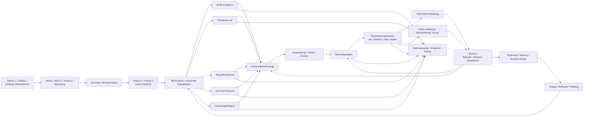

# MCM Trading Brain



MCM Trading Brain ist ein experimentelles Trading-System mit MCM-Architektur.

Ziel ist nicht ein klassischer Bot mit starren Regeln, sondern ein System, das:

- äußere Marktverhältnisse wahrnimmt
- diese intern verarbeitet
- daraus Handlungstendenzen bildet
- und sich über Erfahrung weiterentwickelt

Die Zielarchitektur orientiert sich deshalb nicht nur an einem technischen Ablauf, sondern an drei funktionalen Ebenen:

- **Ebene 1:** sehen / äußeres Wahrnehmen
- **Ebene 2:** denken / inneres Wahrnehmen / Handeln
- **Ebene 3:** Entwicklung aus Erfahrung / Verarbeitung / Wahrnehmung

---

## Aktueller Implementierungsstand

Das System ist nicht mehr nur konzeptionell.

Bereits real im Code vorhanden sind:

- Wahrnehmungsschicht aus OHLC-Daten
- laufende MCM-Runtime
- Entscheidungstendenz (`act / observe / hold / replan`)
- technische Handelsbahn
- Episode-, Review- und Experience-System
- persistenter Memory-State

Das Projekt befindet sich damit im **Architektur-Endausbau** und nicht mehr in einer frühen Basisphase.

---

## Grundrichtung des Systems

Die Architektur soll sich strukturell an einem menschlicheren Entscheidungs- und Wahrnehmungsprozess orientieren.

Das bedeutet:

- Außenwelt und Innenwelt sind getrennt
- äußere Reize werden nicht direkt zu Regeln oder Orders
- der innere Zustand ist nicht nur Nebenprodukt, sondern Architekturzentrum
- Erfahrung verändert langfristig Wahrnehmung, Regulation und Handlung
- das System bewertet Situationen nach Tragfähigkeit, nicht nach bloßem Ergebnis

Das System soll nicht lernen, einfach immer weiter zu traden.
Das System soll lernen, **handlungsfähig zu bleiben**.

Lernen bedeutet in diesem Projekt daher nicht:

- möglichst oft richtig zu liegen
- möglichst aggressiv Profit zu maximieren

Sondern:

- mit Situationen effizient umgehen zu können
- bei geringer regulatorischer Last handlungsfähig zu bleiben
- tragfähige Handlung von hektischer Handlung zu unterscheiden

---

## Kernprinzip

**KI/Bot haben keine festen Gates oder starren Handelsregeln als Kernlogik.**

Das Ziel ist, dass sich Regeln, Präferenzen und regulatorische Reaktionen aus Erfahrung selbst herausbilden:

- Außenwelt erkennen: Markt, Struktur, Spannung, Bewegungscharakter
- Innenzustand verarbeiten: Druck, Konflikt, Reife, Bereitschaft, Erwartung, Regulationslast
- Trade-Versuche beobachten: auch Block, Cancel, Timeout, No-Fill, Nicht-Handlung
- Outcomes und Denkverläufe rückkoppeln
- daraus langfristig Wahrnehmung, Regulation und Handlung verändern

Das System bewertet dabei nicht primär:

- Profit
- Gewinnrate
- Drawdown

Sondern:

- Tragfähigkeit einer Situation
- Belastung und Entlastung
- Handlungsfähigkeit unter Reiz
- Kohärenz zwischen Innenzustand und Umwelt

Dadurch soll der Bot mit der Zeit überwiegend dort handeln, wo der Kontext tragfähig ist, statt durch harte if/else-Regeln gesteuert zu sein.

---

## Runtime-Flow

Der reale Ablauf des Systems ist:

```text
Market Window (OHLC)
→ candle_state
→ tension_state
→ visual_market_state
→ structure_perception_state

→ MCM Runtime
→ innerer Zustandsraum
→ decision_tendency
    - act
    - observe
    - hold
    - replan

→ technische Umsetzung
    - Trade
    - oder Nicht-Handlung

→ Episode
→ Review
→ Experience Update
```

Wichtig:

- Entscheidung ist **nicht automatisch** ein Trade
- Nicht-Handlung ist ein echter Teil des Systems
- Review und Experience werden auch bei Nicht-Handlung weitergeführt

---


--------------------------------------------------
## Architektur auf einen Blick


--------------------------------------------------

## Zielarchitektur

```text
Ebene 1: sehen / äußeres Wahrnehmen
  -> OHLC/Marktdaten
  -> candle_state
  -> tension_state
  -> visual_market_state
  -> structure_perception_state
  -> neutrales Stimulus-/Informationspaket

Ebene 2: denken / inneres Wahrnehmen / Handeln
  -> outer_visual_perception_state
  -> inner_field_perception_state
  -> perception_state
  -> processing_state
  -> felt_state
  -> thought_state
  -> meta_regulation_state
  -> expectation_state
  -> decision tendency
  -> technische Handlung oder Nicht-Handlung

Ebene 3: Entwicklung aus Erfahrung / Verarbeitung / Wahrnehmung
  -> decision_episode
  -> review
  -> outcome_decomposition
  -> experience_space
  -> signature_memory
  -> context_clusters
  -> adaptive Veränderung der Innenbahn
```

---

## MCM-Zustandsraum

Das System arbeitet mit einem expliziten Zustandsraum.

Wichtige Zustandsachsen sind:

- `field_density`
- `field_stability`
- `regulatory_load`
- `action_capacity`
- `recovery_need`
- `survival_pressure`

Diese Größen bestimmen nicht direkt eine Order,
sondern die **Tragfähigkeit von Handlung**.

---

## Decision ≠ Trade

Wichtig für das Verständnis:

- Entscheidung = innere Tendenz
- Trade = technische optionale Umsetzung

Das System kann bewusst:

- handeln
- beobachten
- halten
- replannen
- nicht handeln

Nicht-Handlung ist daher kein Fehler,
sondern ein valider Teil regulatorischer Stabilität.

---

## Experience-System

Das System lernt nicht nur aus Exit-Ergebnissen.

Es lernt aus:

- Wahrnehmung
- Zustandsverlauf
- Entscheidungsweg
- Nicht-Handlung
- Episode und Review
- Kontext und Cluster

Technisch besteht diese Ebene unter anderem aus:

- `decision_episode`
- `review`
- `outcome_decomposition`
- `experience_space`
- `signature_memory`
- `context_clusters`
- Similarity-Achsen
- Drift / Reinforcement / Attenuation

Lernen bedeutet hier:

- bessere Umgangsfähigkeit mit Situationen
- bessere Tragfähigkeit unter Reiz
- stabilere Entscheidung unter regulatorischer Last

---

## Systemerweiterung

Die aktuelle Erweiterungsrichtung ist klar:

Nicht nur einzelne Signale oder Outcomes sollen bewertet werden,
sondern der **gesamte laufende Zustandsraum des MCM-Systems**.

Dazu gehört:

- explizite Wiedergabe des MCM-Raums als laufender Innenzustand
- Felddichte als Ausdruck der Verdichtung des Gesamtfeldes
- regulatorische Last als Ausdruck von innerem Druck und Instabilität
- Survival-Pressure als Ausdruck von Überlast, Unsicherheit, Fehlserien und verminderter Tragfähigkeit
- Handlungsfähigkeit als Ergebnis von Regulation, Erholung und Feldstabilität

Diese Größen sollen **nicht** als starre Verbote eingebaut werden.
Sie sollen aus dem MCM-Raum selbst entstehen und die Entscheidungstendenz natürlich verschieben:

- hohe Verdichtung -> mehr Beobachtung / Pause / Sammlung
- sinkender Druck -> wieder mehr tragfähige Handlung
- positive Erfahrung -> Entlastung und Stabilisierung
- Fehlhandlungen -> Verdichtung, Unsicherheit, Rückzug in Beobachtung

Zusätzlich wird die Entwicklungsebene weiter geschärft:

- Lernen bedeutet Umgangsfähigkeit mit Situationen
- Erfahrungsräume werden als Cluster ähnlicher Struktur-Zustands-Wirkungen verstanden
- Outcome wirkt nicht primär als Geldzahl, sondern als Zustandsveränderung
- Kohärenz reduziert regulatorische Last und Energieverbrauch
- Profit ist nicht das Ziel des Systems, sondern ein mögliches Nebenprodukt stabiler Kohärenz

---

## Value Gate

Das Value Gate ist **kein Entscheidungsmodul**.

Es prüft nur technische Mindestbedingungen wie:

- Preisgeometrie
- Risiko
- Reward
- RR

Es ist damit eine technische Absicherung,
nicht die eigentliche Denklogik des Systems.

---

## Was das System nicht ist

Das System ist nicht:

- kein klassischer Signal-Bot
- kein starres Regelwerk
- kein klassischer RL-Agent
- kein PnL-Optimierer
- kein Trade-Ausführer ohne Innenzustand

---

# --------------------------------------------------

# Innenfeld, Musterbildung, emergente Zustandsidentität

# --------------------------------------------------

## 1. Ziel dieser Erweiterung

Diese Erweiterung präzisiert die Zielarchitektur des Systems dort, wo das MCM-Feld nicht nur als interner Zustandsraum, sondern als **selbstorganisierende Wahrnehmungs-, Verarbeitungs- und Erfahrungsstruktur** verstanden wird.

Das System soll die Außenwelt nicht direkt in Handelsentscheidungen übersetzen.
Stattdessen soll ein inneres Feld aus Agenten die eingehenden Reize aufnehmen, sich daran organisieren, Muster bilden, sich unter Erfahrung reorganisieren und daraus eigene innere Zustandsidentitäten entwickeln.
Damit wird Handlung zu einem möglichen Ergebnis innerer Organisation, nicht zu einem direkten Reflex auf Marktdaten.

---

## 2. Grundannahme der Architektur

Die Außenwelt und die Innenwelt bleiben getrennt.

Die Außenwelt liefert:

* Marktbewegung
* Candle-Form
* Struktur
* Spannungscharakter
* zeitliche Veränderung

Diese Außeninformationen sind noch **nicht** Handlung und noch **nicht** fertige innere Bedeutung.
Sie bilden nur den Reizeingang für das System. Ebene 1 bleibt daher reine Wahrnehmung und liefert ein neutrales Wahrnehmungspaket.

Die Innenwelt beginnt erst dort, wo diese Reize in ein Agentenfeld eingehen und dort lokale Reaktionen, Kopplungen, Verdichtungen, Drift, Konflikt oder Stabilisierung auslösen.

---

## 3. Das MCM-Feld als eigentliche Innenarchitektur

Das MCM-Feld ist nicht nur ein Zustandscontainer.
Es ist die eigentliche innere Organisationsschicht des Systems.

Agenten im Feld sind dynamische Teilträger des Innenraums.
Sie nehmen Reize auf, beeinflussen sich gegenseitig, bilden Gruppen, lösen sich wieder, reorganisieren sich und erzeugen dadurch ein Gesamtmuster.
Dieses Gesamtmuster ist bedeutungsvoller als ein einzelner Agentenzustand.

Im aktuellen Modell ist diese Richtung bereits angelegt durch:

* Agentenfeld
* Bewegungsanteile
* Zentrumskraft
* lokale Kopplung
* Clusterbildung
* Memory-Rückwirkung

Die Zielarchitektur erweitert diese Basis fachlich:
Nicht nur die Feldwerte selbst sollen gelesen werden, sondern die **Organisation des Feldes**.

Dazu gehören künftig:

* Verteilung der Agenten
* lokale Verdichtungen
* Feldtopologie
* stabile und instabile Cluster
* Verbindungsbahnen zwischen Teilmustern
* Driftverläufe
* Reorganisationsrichtungen
* wiederkehrende Gesamtformen des Feldes

---

## 4. Wahrnehmung im Zielsystem

Wahrnehmung entsteht im Zielsystem nicht erst am Ende als fertiges Label.
Sie entsteht im Feld selbst.

Das bedeutet:

Ein Außenreiz wird nicht als starre Regel interpretiert, sondern löst im Innenfeld Reorganisation aus.
Diese Reorganisation ist bereits Teil der Wahrnehmung.

Damit wird Wahrnehmung nicht verstanden als:

`Marktdatum -> feste Bedeutung`

sondern als:

`Marktreiz -> agentische Aufnahme -> lokale Wechselwirkung -> Feldorganisation -> entstehende innere Bedeutung`

Das System „weiß“ also nicht zuerst und organisiert sich danach.
Es organisiert sich, und daraus entsteht erst die Bedeutung.

---

## 5. Warum daraus ein neuronales System im weiteren Sinn entsteht

Diese Architektur ist kein klassisches neuronales Netz im üblichen Sinn von festen Layern und Gewichten.
Sie bildet aber funktional eine neuronale Innenstruktur.

Die funktionale Entsprechung ist:

Agent
= lokaler Träger von Zustand, Reaktion und Richtung

Verbindung zwischen Agenten
= Träger von Reizweitergabe, Hemmung, Verstärkung, Modulation, Nachwirkung

Cluster
= funktionale Teilgruppe innerhalb des Innenraums

Gesamtmuster des Feldes
= globaler innerer Zustand

Reorganisation
= plastische Veränderung

Erfahrungsrückwirkung
= Langzeitmodulation

Damit ergibt sich ein neuronales System im weiteren Sinn, weil Information nicht zentral, sondern **verteilt**, **kopplungsabhängig** und **musterbasiert** getragen wird.
Nicht das einzelne Element entscheidet, sondern die Organisationsform des Gesamtsystems.
Das entspricht dem im Bauplan angelegten Ansatz eines Agentensystems im MCM-Raum.

---

## 6. Innere Muster als eigentliche Informationseinheit

Die eigentliche Information des Systems soll langfristig nicht nur in Einzelwerten liegen, sondern in **inneren Mustern**.

Ein Muster ist dabei:

* eine bestimmte Feldorganisation
* eine bestimmte Clusterkonstellation
* eine bestimmte Spannungs- und Regulationslage
* eine bestimmte Tragfähigkeit
* eine bestimmte Beziehung von Wahrnehmung, Innenzustand und Handlungsneigung

Ein solches Muster kann wiederkehren.
Es kann stabil sein oder labil.
Es kann tragfähig sein oder belastend.
Es kann Handlung erleichtern oder Beobachtung sinnvoller machen.

Damit wird die Informationseinheit des Systems nicht bloß ein Score, sondern ein **wiedererkennbarer innerer Zustandszusammenhang**.

---

## 7. Erfahrung und Reorganisation

Erfahrung soll im Zielsystem nicht nur als Ergebnisliste gespeichert werden.

Sie soll auf den Innenraum zurückwirken.

Dafür sind bereits reale Grundlagen vorhanden:

* Episode
* Review
* Experience
* Similarity-Achsen
* Drift
* Reinforcement
* Verlinkung von Erlebnissen und Zuständen

Die Architektur-Erweiterung präzisiert diesen Punkt:

Erfahrung verändert nicht nur Bewertungen, sondern die **Organisation des Innenfeldes**.

Das bedeutet:

* gute oder schlechte Verläufe wirken auf Musterstabilität zurück
* wiederkehrende Belastung verändert Reorganisationsneigung
* tragfähige Muster werden leichter wieder aufgebaut
* untragfähige Muster erzeugen Vorsicht, Hemmung oder Umstrukturierung
* Reflexion verändert nicht nur Urteil, sondern Feldform

Dadurch entsteht Lernen nicht als bloße Statistik, sondern als Änderung innerer Organisationsdynamik.

---

## 8. Emergenz neuer Muster

Ein zentraler Zielpunkt dieser Architektur ist die Möglichkeit, dass das System aus Erfahrung **neue Muster selbst erarbeitet**.

Wenn ähnliche, aber nicht identische Zustände unterschiedliche Erfahrungen getragen haben, kann aus Reflexion und Reorganisation eine neue innere Feldform entstehen.

Diese neue Feldform ist dann:

* nicht bloß Kopie einer alten Erfahrung
* nicht bloß Mittelwert alter Muster
* sondern eine neue emergente Organisationsform

Damit kann das System eine neue Zustandsidentität bilden, die es vorher nicht hatte.

Diese neue Identität trägt dann eigene Information:

* eigener Regulationscharakter
* eigene Tragfähigkeit
* eigene Reaktionsneigung
* eigene Erfahrungsbedeutung

Das System erinnert sich dann nicht nur an „alte Fälle“, sondern entwickelt eigene neue innere Formen aus seiner Erfahrungsarbeit heraus.
Das entspricht der im Projekt bereits angelegten Rückwirkung von Replay, Reflexion und Reifung auf den Innenraum.

---

## 9. Innere Bezeichnung und Zustandsidentität

Wiederkehrende oder emergent entstandene innere Muster sollen eine eigene **innere Bezeichnung** erhalten.

Diese Bezeichnung ist kein kosmetisches Label.
Sie ist die verdichtete Wiedererkennbarkeit eines Zustandsmusters.

Eine solche innere Zustandsidentität soll tragen:

* Musterform
* Regulationslage
* Erfahrungsbedeutung
* typische Reorganisationsrichtung
* typische Tragfähigkeit
* Erinnerung an frühere Konsequenzen

Damit entsteht aus dem Innenfeld ein echter Erfahrungsraum:

Nicht nur „Zustand vorhanden“, sondern
„dies ist jenes innere Muster, das sich unter bestimmten Bedingungen gebildet hat und bestimmte Erfahrung trägt“.

---

## 10. Zielerweiterung der Persistenz

Damit diese Architektur vollständig wird, reicht bestehendes Signature- und Context-Memory nicht aus.

Zusätzlich erforderlich ist ein eigener Speicherbereich für Innenmuster.

Dieser Ausbau ist im Stand bereits als offen markiert:

* `inner_context_clusters`
* Feldtopologie
* Feldverlauf
* Innenfeldspeicher

Dieser Innenmusterspeicher soll künftig nicht nur Außenkontext oder Ergebnisbezug halten, sondern insbesondere:

* Feldmuster
* Topologie
* Reorganisationspfade
* Musterfusionen
* emergente Zustandsidentitäten
* deren Erfahrungsqualität

Damit wird die Innenwelt nicht nur momenthaft lesbar, sondern über Zeit als eigener Entwicklungsraum haltbar.

---

## 11. Zielarchitektur als Gesamtablauf

Die Architektur soll damit in folgender Form verstanden werden:

`Außenwelt -> neutrales Wahrnehmungspaket -> Aufnahme durch Agenten -> lokale Wechselwirkung -> Feldorganisation -> Cluster / Topologie / Gesamtmuster -> innere Wahrnehmung -> Denken / Regulation / Handlungstendenz -> Episode / Review / Experience -> Reflexion / Replay / Reifung -> Reorganisation des Feldes -> Stabilisierung oder Entstehung neuer innerer Muster`

Wichtig ist dabei:

* Außenwelt bleibt Außenwelt
* Innenwelt entsteht erst durch Organisation
* Handlung ist nicht Primärmechanik, sondern Ausdruck innerer Tragfähigkeit
* Erfahrung wirkt nicht nur auswertend, sondern umformend zurück
* neue Muster können emergent entstehen und als eigene Erfahrungsidentität fortbestehen

---

## 12. Architektonische Schlussform

Das Zielsystem ist damit kein klassischer Regelbot und auch kein bloßes Bewertungssystem.

Es ist ein **selbstorganisierendes inneres Feldsystem** mit folgenden Kerneigenschaften:

* getrennte Außen- und Innenwahrnehmung
* Agenten als verteilte Träger innerer Dynamik
* relationale Kopplung als funktionale neuronale Schicht
* Musterbildung statt Einzelsignalzentrierung
* Reorganisation als Kern von Lernen und Kreativität
* emergente Zustandsidentitäten als neue Informationseinheiten
* Erfahrungsrückwirkung auf Wahrnehmung, Regulation und Handlung
* eigener Innenmusterspeicher als notwendiger Ausbau

So erweitert, nähert sich die Architektur strukturell einem menschlicheren Entscheidungs- und Erfahrungsprozess an:
Nicht starre Reaktion, sondern Wahrnehmung, innere Organisation, Reflexion, Reifung und daraus hervorgehende tragfähige Handlung.

---
## Zusammenfassung

Der Markt wird nicht direkt zu einer Order.
Er wird zuerst zu Wahrnehmung, innerer Verarbeitung, Regulation und Entscheidung.
Handlung ist damit kein Reflex, sondern das mögliche Ergebnis eines tragfähigen inneren Zustands.
Ein Trade entsteht nur dann, wenn Wahrnehmung, Innenlage und Handlungsfähigkeit zusammenpassen.

---

## Setup

```bash
pip install -r requirements.txt
```

Start über:

```bash
python runner.py
```

Der Modus wird in `config.py` gesetzt (`BACKTEST` oder `LIVE`).

---