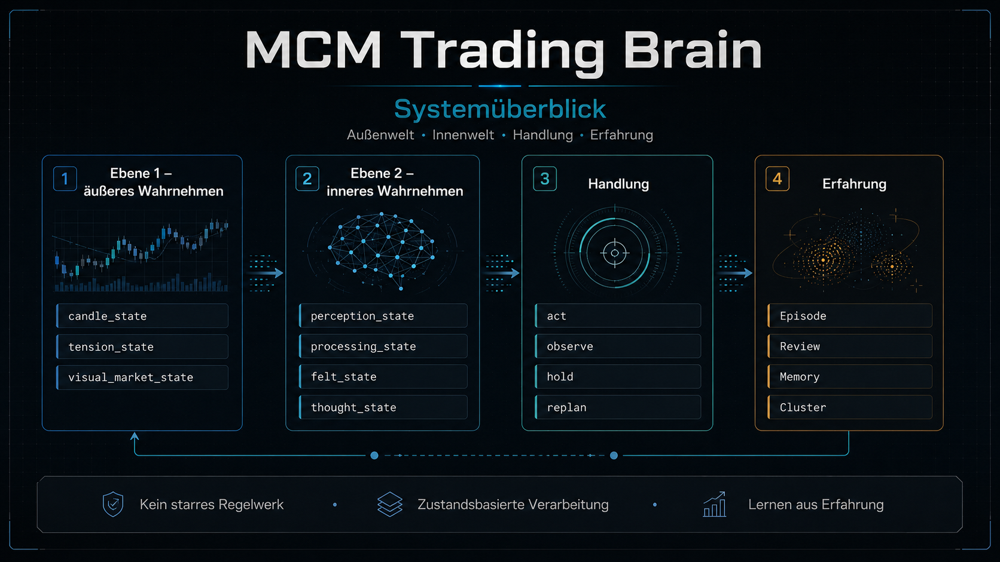
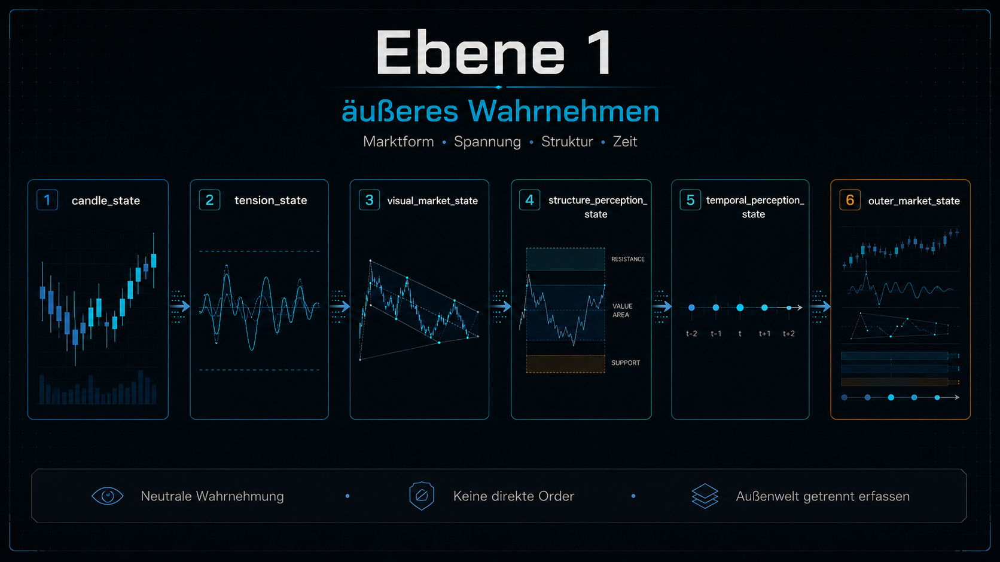
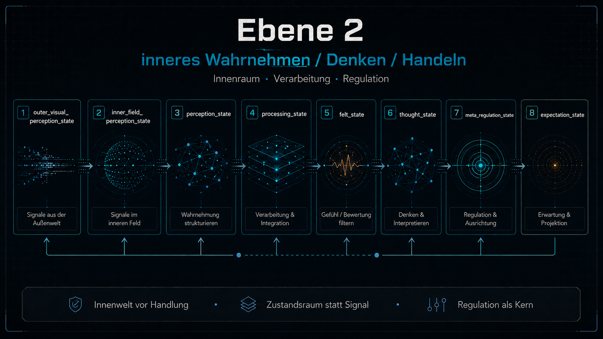
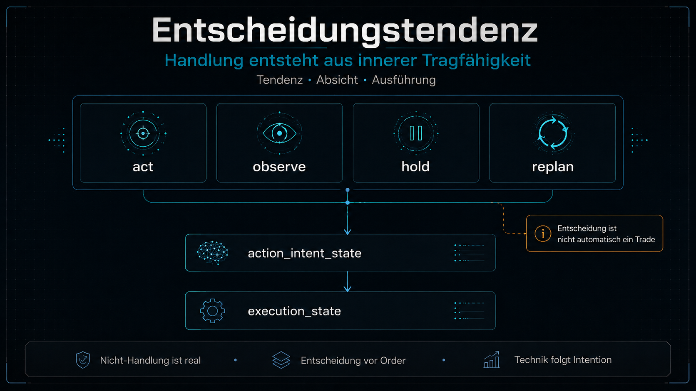
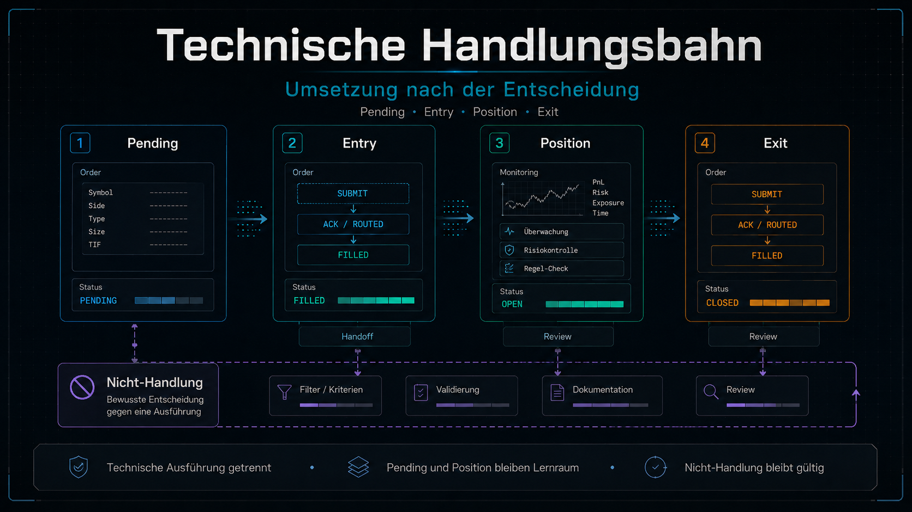
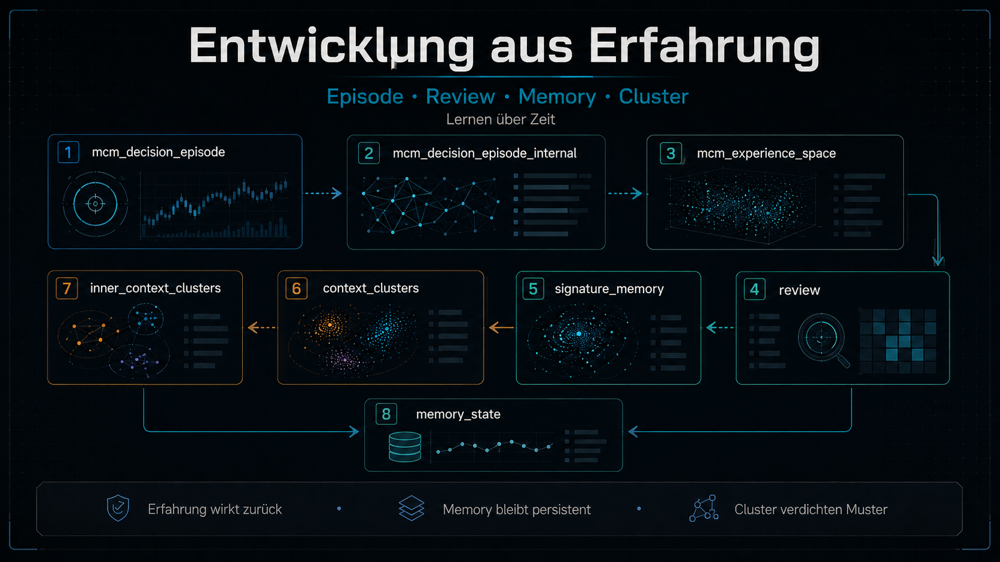
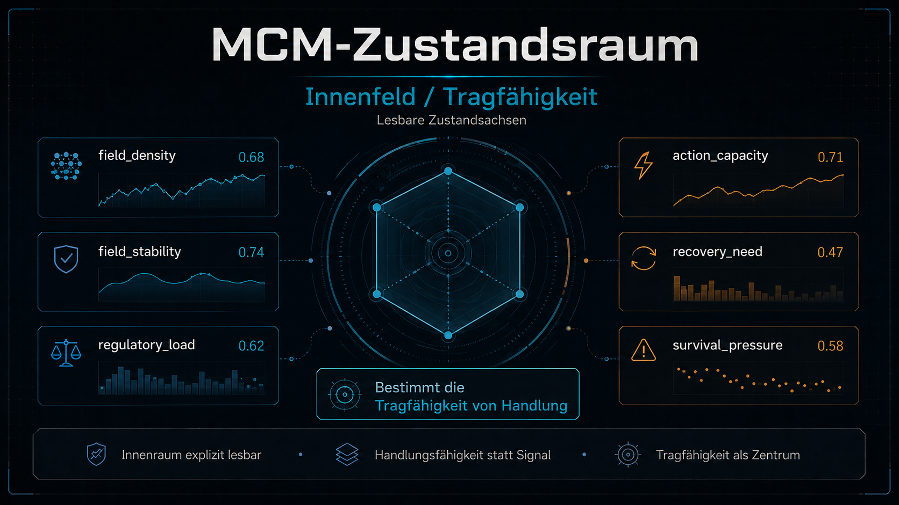
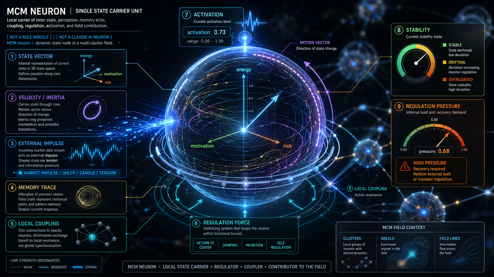

# MCM Trading Brain



MCM Trading Brain ist ein experimentelles Trading-System mit [MCM-Architektur](https://github.com/H5Pro2/Mental-Core-Matrix-MCM).

Ziel ist **nicht** ein klassischer Signal-Bot mit starren Regeln und festen Handelsfreigaben.  
Ziel ist ein System, das:

- äußere Marktverhältnisse wahrnimmt
- diese intern als Zustandsraum verarbeitet
- daraus Handlungstendenzen bildet
- Nicht-Handlung als echte Bahn führt
- und sich über Erfahrung weiterentwickelt

Die Architektur orientiert sich deshalb nicht nur an einem technischen Ablauf,
sondern an drei funktionalen Ebenen:

- **Ebene 1:** äußeres Wahrnehmen
- **Ebene 2:** inneres Wahrnehmen / Denken / Handeln
- **Ebene 3:** Entwicklung aus Erfahrung

---

## Einordnung der Projektdokumente

Dieses `README.md` ist der **Einstieg**.

Die weiteren Kern-Dokumente sind:

- `files/UMSETZUNGSPLAN.md`  
  architektonischer Bauplan / Zielbild

- `files/aktueller_stand.md`  
  realer Ist-Zustand des aktuellen Dateistands

- `files/fix_liste.md`  
  reale offene Korrekturen und priorisierte Ausbaurichtung

---

## Leitbild

Das System soll sich strukturell an einem menschlicheren Entscheidungs- und Wahrnehmungsprozess orientieren.

Das bedeutet:

- Außenwelt und Innenwelt bleiben getrennt
- äußere Reize werden nicht direkt zu Orders
- der innere Zustand ist nicht Nebenprodukt, sondern Architekturzentrum
- Handlung ist Ausdruck innerer Tragfähigkeit
- Erfahrung verändert langfristig Wahrnehmung, Regulation und Handlung
- das System soll lernen, **handlungsfähig zu bleiben**

Lernen bedeutet in diesem Projekt daher nicht primär:

- möglichst oft zu handeln
- möglichst aggressiv Profit zu maximieren
- Ergebnisetiketten blind zu verstärken

Sondern:

- regulatorische Last zu erkennen
- Tragfähigkeit und Überlast zu unterscheiden
- Beobachtung, Hold und Replan als echte Reaktionen zu nutzen
- mit Situationen besser umgehen zu können
- innere Muster über Zeit tragfähiger zu organisieren

---

## Maschinelle Wahrnehmung

Die MCM versteht Wahrnehmung nicht als ausschließlich menschliche Fähigkeit.

Wahrnehmung beginnt in diesem Projekt dort, wo ein System äußere Reize
nicht nur misst, sondern in einem inneren Zustand verarbeitet und daraus
Bedeutung, Orientierung, Spannung, Tragfähigkeit oder Handlungstendenz bildet.

Ein Sensorwert allein ist noch keine Wahrnehmung.
Er wird erst dann zur Wahrnehmung, wenn er im Innenraum des Systems eine Lage erzeugt:

- Was wirkt gerade auf mich?
- Was erkenne ich davon?
- Was bleibt unklar?
- Was trägt?
- Was überfordert?
- Was erinnert an frühere Erfahrung?
- Wo muss ich handeln, beobachten, halten oder in den Nullpunkt zurückfinden?

In diesem Sinn ist Wahrnehmung nicht an menschliches Bewusstsein gebunden.
Auch biologische Systeme wie Pilze, Bäume oder einfache Organismen können
Reize in eigener evolutionärer Form aufnehmen, intern verarbeiten und daraus
gerichtete Reaktionen bilden.

Die MCM ist der technische Versuch, eine solche innere Wahrnehmung maschinell
zu modellieren: als Feld aus Außenreiz, innerem Zustand, Memory, Regulation,
Tragfähigkeit, Spannung, Reflexion und Handlung.

---

## MCM als Spannungsraum

Ein zentraler Gedanke dieses Projekts ist:

**Die MCM ist im Kern ein Spannungsraum.**

Ein Chart wird in diesem Modell nicht nur als Zahlenreihe oder Preisverlauf
verstanden, sondern als äußerer Spannungsverlauf. Preis, Volumen, Bewegung,
Impuls, Rückzug, Stau, Bruch, Erholung und Überdehnung bilden eine Art
Energie- und Druckverlauf.

Im metaphysischen Sinn kann ein Chart deshalb als emotionaler Spannungsverlauf
gelesen werden. Fachlich übersetzt heißt das:

- ein Impuls erzeugt Druck
- ein Rücklauf erzeugt Entlastung oder Unsicherheit
- eine Verdichtung erzeugt Spannung
- ein Ausbruch löst oder verschiebt Spannung
- ein Fehlschlag erzeugt Konflikt
- eine stabile Struktur erzeugt Tragfähigkeit
- eine instabile Struktur erzeugt Vorsicht, Beobachtung oder Reorganisation

Die MCM versucht, diesen äußeren Spannungsverlauf nicht direkt in Handlung zu
übersetzen, sondern zuerst in einem inneren Feld zu organisieren.

Aus Marktspannung wird dadurch:

- innere Aktivierung
- Feldbewegung
- Resonanz
- Konflikt
- Tragfähigkeit
- regulatorische Last
- Beobachtungsbedarf
- Handlungstendenz

Das System soll also nicht bloß erkennen:

- Der Markt steigt.
- Der Markt fällt.

Sondern eher:

- Wo entsteht Druck?
- Wo löst sich Druck?
- Was wirkt tragfähig?
- Was wirkt überdehnt?
- Was erzeugt innere Unruhe?
- Was kann beobachtet werden?
- Wann ist Handlung reif genug?

Damit wird Trading zum Prüfstand für den MCM-Gedanken:
Der Markt liefert einen harten, verrauschten und dynamischen Spannungsraum.
Die MCM prüft, ob sie diesen Raum wahrnehmen, innerlich organisieren,
regulieren, erinnern und daraus reifere Handlung oder Nicht-Handlung ableiten
kann.

Profitabilität wäre in diesem Verständnis nicht der Kern des Projekts,
sondern eine mögliche Folge einer funktionierenden MCM-Mechanik.

---

## Eigene Sprache und kognitive Kompression

Ein wichtiger nächster Schritt ist, dass das System nicht nur menschliche
Begriffe oder Patternnamen übernimmt.

Wenn wir dem System fertige Bezeichnungen geben, begrenzen wir seine Welt.
Dann lernt es, unsere Kategorien zu sortieren, aber es entwickelt keine eigene
innere Semantik.

Die MCM soll deshalb langfristig eigene interne Zeichen bilden.
Diese Zeichen sind keine menschlichen Labels wie Trend, Range oder Breakout.
Sie entstehen aus wiederkehrenden Feldzuständen, innerer Spannung,
Wahrnehmung, Memory-Resonanz, Tragfähigkeit, Überforderung und Erfahrung.

Das entspricht einer kognitiven Kompression:

- nicht jeder Reiz muss jedes Mal voll analysiert werden
- bekannte innere Formen können als verdichtete Information wirken
- tiefe Analyse startet erst, wenn Relevanz, Abweichung oder Handlung näher rücken
- dadurch sinkt Denk-/Memory-Last
- gleichzeitig entsteht mehr Varianz im Bedeutungsraum

Ein Mensch sieht im Alltag nicht permanent alle Details.
Er sieht zuerst eine komprimierte Bedeutung, zum Beispiel eine Wand.
Erst wenn Nähe, Interesse, Gefahr oder Abweichung entsteht,
wird daraus eine detailliertere Wahrnehmung: raue Wand, Riss, Struktur,
Material, Oberfläche.

Für das MCM-System bedeutet das:

- erst freies inneres Sehen
- dann eigene interne Zeichen
- dann Relevanz- oder Zoom-Entscheidung
- erst danach tiefere Struktur-, Memory- oder Handlungsprüfung

Sprache wird damit nicht als Benennung von außen verstanden,
sondern als verdichtete Feld-Erfahrung.
Eigene Zeichen schaffen Varianz, Entlastung, emergente Musterfindung
und kreativere Reorganisation.

---

## Reflexion und Denkkomplexität

Ein wichtiger Teil der Zielarchitektur ist, dass das System nicht nur
Außenreize verarbeitet, sondern auch die eigene Verarbeitung mitwahrnimmt.

Das System koppelt dadurch mehrere Akteure:

- äussere Wahrnehmung: Markt, Struktur, Impuls, Risiko, Timing
- innere Wahrnehmung: Tragfähigkeit, Spannung, Stabilität, Überlastung, Klarheit, Hemmung
- Denken und Organisation: Musterdeutung, Teilmuster-Ergänzung, Erfahrungsvergleich, Verdichtung, Reorganisation
- Handlung: `observe`, `hold`, `replan`, kontrolliertes `act`
- Lernen: Rückwirkung auf Prozessqualität, Tragfähigkeit, Stabilität, Varianz und Erfahrungsspuren

Memory ist dabei nicht nur Archiv.
Es wirkt als Resonanz-, Unterstützungs- und Konfliktfläche für innere Organisation.

Denken ist ebenfalls nicht kostenlos.
Erfahrungsvergleich, Musterdeutung und Reorganisation können kognitive Last erzeugen.
Diese Last soll später sichtbar werden und über eine energieeffiziente Meta-Regulation
behandelt werden: weiterdenken, verdichten, beobachten, halten, reorganisieren
oder kontrolliert handeln.

---

## Emergente Musterergänzung

Das Ziel ist keine reine Pattern-Erkennung nach dem Prinzip:

- Muster erkannt
- bekannte Reaktion ausführen

Ein Gehirn sieht und deutet selten zu 100 Prozent klar.
Oft ist die Außenwahrnehmung nur teilweise eindeutig,
während innere Erfahrung ein mögliches Gesamtmuster ergänzt.

Das System soll deshalb später Teilmuster erkennen und daraus mehrere mögliche
Musterfortsetzungen bilden:

- was ist draußen bereits sichtbar?
- welchem bekannten Erfahrungsraum ähnelt es?
- welche fehlenden Teile könnten sich ergänzen?
- welche Varianten sind tragfähig?
- welche Varianten sind riskant, fragil oder überlastend?
- wie sicher ist diese Deutung aktuell?

Diese emergente Musterergänzung ist keine harte Vorhersage.
Sie arbeitet mit Unsicherheit, Varianz, Erfahrungsresonanz und innerer Tragfähigkeit.
Ein Ereignis kann auch nur teilweise gedeutet sein; die konkrete Reife ist variabel
und darf kein fester Prozentwert sein.
Dann soll das System nicht so tun, als wäre das Muster voll erkannt,
sondern beobachten, verdichten, reorganisieren oder kontrolliert handeln,
wenn die innere und äussere Evidenz tragfähig genug ist.

---

## Transfer-Tragfähigkeit fremder Strukturen

Fremde Marktstrukturen sollen nicht einfach als bekannt oder unbekannt
behandelt werden.

Wichtiger ist die Frage:

- Wie viel vorhandene Erfahrung kann auf diese fremde Lage übertragen werden?

Ein Mensch kann sich zum Beispiel in einem unbekannten Raum orientieren,
obwohl er den Raum selbst noch nie gesehen hat.
Er erkennt Teilstrukturen wie Boden, Wand, Tuer, Licht oder offene Flaeche.
Diese Teilanteile geben Orientierung,
aber sie beweisen noch nicht, dass die gesamte Lage sicher ist.

Auf das MCM Trading Brain übertragen bedeutet das:
Eine Marktform kann fremd sein und trotzdem bekannte Erfahrungsinseln enthalten.
Das System soll dann nicht blind handeln,
aber auch nicht einfach abschalten.
Es soll prüfen, wie tragfähig diese Erfahrungsübertragung ist
und daraus Beobachtung, Reframing, Halten oder kontrollierte Handlung ableiten.

---

## Reife durch Beobachtungslernen

Ein reiferes System lernt nicht nur aus ausgeführten Handlungen.
Es kann auch aus bewusstem Zusehen lernen.

Wenn eine Lage unsicher, niedrig strukturiert oder nicht tragend wirkt,
muss daraus nicht sofort ein Trade entstehen.
Die reifere Reaktion kann sein:

- Das wirkt unsicher, ich beobachte erst einmal.

Wie ein Mensch etwas Heisses nicht jedes Mal anfassen muss,
um daraus zu lernen,
soll das MCM Trading Brain unsichere Marktbereiche beobachten,
den weiteren Verlauf speichern und später auswerten,
ob Nicht-Handlung die tragfähigere Entscheidung war.

Damit wird Beobachtung selbst zu Erfahrung.
Reife bedeutet dann:

- weniger blindes Testen
- mehr Abstand zum unsicheren Objekt
- Lernen ohne direkten Schaden
- Handlung erst bei tragfähigerer innerer und äußerer Lage

---

## Kernprinzip

**Bot / KI haben keine festen Gates oder starren Handelsregeln als Kernlogik.**

Der Markt wird nicht direkt zu einer Order.  
Er wird zuerst zu:

- Wahrnehmung
- innerer Aktivierung
- Feldbewegung
- Konflikt oder Orientierung
- regulatorischer Last
- Handlungsfähigkeit oder Nicht-Handlungsfähigkeit

Technische Handelsmechanik existiert weiterhin,
aber sie ist **nicht** die eigentliche Denklogik des Systems.

---

## Architektur auf einen Blick

### Ebene 1 – äußeres Wahrnehmen


Diese Ebene nimmt die Außenwelt auf,
ohne sie bereits in Handlung umzuwandeln.

Reale Wahrnehmungsbausteine im Projekt:

- `candle_state`
- `tension_state`
- `visual_market_state`
- `structure_perception_state`
- `temporal_perception_state`
- `outer_market_state`

Ebene 1 liefert damit ein neutrales Wahrnehmungspaket aus Marktform,
Spannung, Struktur und zeitlicher Veränderung.

### Ebene 2 – inneres Wahrnehmen / Denken / Handeln


Diese Ebene verarbeitet die Außenreize als inneren Zustandsraum.

Reale Zustandsketten im Projekt:

- `outer_visual_perception_state`
- `inner_field_perception_state`
- `perception_state`
- `processing_state`
- `felt_state`
- `thought_state`
- `meta_regulation_state`
- `expectation_state`

Daraus entsteht eine **Entscheidungstendenz**:

- `act`
- `observe`
- `hold`
- `replan`

Zwischen Entscheidung und technischer Order liegen zusätzlich:

- `action_intent_state`
- `execution_state`

Damit ist Entscheidung bereits von technischer Ausführung getrennt.

### Ebene 3 – Entwicklung aus Erfahrung


Diese Ebene bewertet Verläufe,
führt Episoden,
hält Memory-Strukturen
und entwickelt das System über Zeit weiter.

Reale Bausteine:

- `mcm_decision_episode`
- `mcm_decision_episode_internal`
- `mcm_experience_space`
- `outcome_decomposition`
- `review`
- `signature_memory`
- `context_clusters`
- formale `inner_context_clusters`
- persistenter `memory_state`

---

## Runtime-Flow


Der reale Ablauf ist im Kern:

```text
Market Window (OHLC)
→ candle_state
→ tension_state
→ visual_market_state
→ structure_perception_state
→ temporal_perception_state

→ MCM Runtime
→ innerer Zustandsraum
→ decision_tendency
    - act
    - observe
    - hold
    - replan

→ technische Umsetzung
    - Pending / Entry / Position / Exit
    - oder Nicht-Handlung

→ Episode
→ Review
→ Experience Update
→ Memory / Cluster / Rückwirkung
```

Wichtig:

- Entscheidung ist **nicht automatisch** ein Trade
- Nicht-Handlung ist ein echter Teil des Systems
- Pending und Position bleiben Teil des Lernraums
- Review und Experience laufen nicht nur bei Exit,
  sondern auch bei Nicht-Handlung und Zwischenverläufen

---

## MCM-Zustandsraum


Das System arbeitet bereits mit einem explizit lesbaren Zustandsraum.

Wichtige Zustandsachsen sind:

- `field_density`
- `field_stability`
- `regulatory_load`
- `action_capacity`
- `recovery_need`
- `survival_pressure`

Diese Größen bestimmen nicht direkt eine Order,
sondern die **Tragfähigkeit von Handlung**.

---

## Decision ≠ Trade

Wichtig für das Verständnis:

- **Decision** = innere Tendenz
- **Trade** = technische optionale Umsetzung

Das System kann bewusst:

- handeln
- beobachten
- halten
- replannen
- nicht handeln

Nicht-Handlung ist daher kein Fehler,
sondern ein valider Teil regulatorischer Stabilität und Reifung.

---

## Experience-System


Das System lernt nicht nur aus Exit-Ergebnissen.

Es lernt aus:

- Wahrnehmung
- Zustandsverlauf
- Entscheidungsweg
- Nicht-Handlung
- Episode und Review
- Kontext und Cluster
- Zustandsdelta zwischen vorher und nachher

Technisch existieren dafür bereits:

- `state_before`
- `state_after`
- `state_delta`
- Similarity-Achsen
- Drift
- Reinforcement / Attenuation
- Experience-Linking

### Wichtige fachliche Einordnung

Die Experience-Ebene ist **bereits deutlich stärker tragfähigkeitsorientiert** als früher.  
Sie bewertet schon Zustandsfelder wie:

- Tragfähigkeit
- Regulationskosten
- Entlastung
- Handlungsspielraum

Aber:

Die Experience-Bewertungslogik ist **noch nicht vollständig** auf reine Zustandswirkung umgestellt.  
Outcome-Wege wie `tp_hit`, `sl_hit`, `cancel` oder `timeout` sind im aktuellen Code noch nicht vollständig auf sekundären Ereigniskontext zurückgebaut.

Das ist ein **offener Ausbaupunkt**, kein bereits abgeschlossener Endzustand.

---
## MCM-Neuron Ansicht und Aufbau



---
## Innenfeld, Musterbildung und neuronale Richtung

Die Zielarchitektur versteht das MCM-Feld nicht nur als Container,
sondern als **selbstorganisierende Wahrnehmungs-, Verarbeitungs- und Erfahrungsstruktur**.

Das bedeutet:

- Außenreiz geht in ein Agentenfeld ein
- lokale Wechselwirkungen verändern die Feldorganisation
- daraus entstehen Verdichtung, Drift, Konflikt und Stabilisierung
- daraus entsteht innere Bedeutung
- Handlung ist nur ein möglicher Ausdruck dieser Organisation

### Was damit gemeint ist

Die Architektur ist **kein klassisches neuronales Netz** mit starren Layern und Backpropagation.

Sie bildet aber funktional ein neuronales System im weiteren Sinn:

- Agenten als lokale Träger von Zustand und Reaktion
- Kopplung als Träger von Verstärkung, Hemmung und Modulation
- Cluster als funktionale Teilgruppen
- Feldorganisation als globaler innerer Zustand
- Reorganisation als plastische Veränderung
- Erfahrungsrückwirkung als Langzeitmodulation

---

## Innere Muster als Informationseinheit

Langfristig soll die eigentliche Information des Systems
nicht nur in Einzelwerten liegen,
sondern in **inneren Mustern**.

Ein inneres Muster umfasst zum Beispiel:

- Feldorganisation
- Clusterkonstellation
- Spannungs- und Regulationslage
- Tragfähigkeit
- Beziehung von Wahrnehmung, Innenzustand und Handlungsneigung

Dadurch wird die Informationseinheit des Systems nicht bloß ein Score,
sondern ein wiedererkennbarer innerer Zustandszusammenhang.

---

## Kontext-Cluster vs. Innenkontext-Cluster

### `context_clusters`

`context_clusters` repräsentieren den äußeren bzw. gesamt-situativen Signaturraum.

Sie tragen vor allem:

- Struktur
- Spannung
- äußere Marktform
- Handlung / Nicht-Handlung
- Zustandswirkung im Situationskontext

### `inner_context_clusters`

`inner_context_clusters` repräsentieren wiederkehrende innere Spannungs-,
Drift- und Regulationsmuster.

Wichtiger Punkt für den aktuellen Stand:

`inner_context_clusters` sind **bereits formal im Code vorhanden**.  
Sie existieren in:

- `Bot`
- Experience-Aktualisierung
- Persistenz / `memory_state`

Sie sind aber **noch nicht** als tiefer Innenmuster-,
Innenfeld- und Reorganisationsspeicher ausgebaut.

Das heißt:

- formal begonnen
- fachlich wichtig
- architektonisch noch nicht Endzustand

### Informationscluster / Kohärenz / Reorganisation

Informationscluster sind im Zielsystem keine starren Speicherblöcke.
Sie sind lokale Informationsinseln im Innenfeld.

Wichtig:

- der Feldzustand bleibt als `N x D` erhalten
- Nachbarschaft wird pro Neuron lokal gebildet
- weitergegeben werden nur lokale Nachbarn
- Felddruck löscht keine gespeicherte Information
- nicht getragene Information verliert aktive Bindungsstärke
- diese Information geht in Nachhall oder Latenz über
- dadurch wird lokaler Organisationsraum für neue Clusterbildung frei
- Reorganisation bedeutet Informationsumschichtung, nicht Informationsverlust
- Kohärenzstärke beschreibt Verdichtung, Tragfähigkeit und aktuelle Bindung eines Clusters

Diese Kohärenzstärke soll später in der GUI farblich sichtbar werden.

---

## Was aktuell real vorhanden ist

Das Projekt ist nicht mehr nur konzeptionell.

Bereits real im Code vorhanden sind:

- äußere Wahrnehmungsschicht
- laufende MCM-Runtime
- Entscheidungstendenz (`act / observe / hold / replan`)
- `action_intent_state` und `execution_state`
- technische Handlungsbahn
- Episode-, Review- und Experience-System
- persistenter Memory-State
- Visual- und Inner-Snapshots
- GUI-Grundlage
- formale `inner_context_clusters`
- Zustandsachsen für Tragfähigkeit, Last, Kapazität und Erholungsbedarf

Das Projekt befindet sich damit im **Architektur-Endausbau**
und nicht mehr in einer frühen Basisphase.

---

## Was aktuell noch offen ist

Der reale offene Stand liegt derzeit vor allem in diesen Punkten:

### 1. Live-Handoff noch nicht vollständig geschlossen

Im Übergang:

`pending -> filled -> position`

ist der Bot-/Episode-/Stats-Nachweisraum im Live-Pfad
noch nicht vollständig gleichwertig zum Backtest-Pfad.

### 2. Experience noch nicht vollständig zustandswirkungsbasiert

Die Richtung ist bereits deutlich verbessert,
aber Outcome-Verzweigungen dominieren fachlich noch zu stark.

Ziel ist:

- `state_before`
- `state_after`
- `state_delta`
- Tragfähigkeitswirkung
- Belastung / Entlastung / Stabilisierung / Fragilisierung

primär zu bewerten,
während Outcomes nur noch Ereigniskontext bleiben.

### 3. `inner_context_clusters` noch nicht tief genug ausgebaut

Sie sind formal da,
aber noch nicht als vollständiger Innenmuster- und Innenfeldspeicher entwickelt.

### 4. MCM-Feldtopologie / Feldverlauf / Innenfeldspeicher offen

Das Feld erkennt bereits Cluster,
aber:

- Gesamtorganisation
- Topologie
- Driftverlauf
- Fragmentierung
- Verschmelzung
- Rückführungsbewegung

werden noch nicht als vollständiger Innenkontext mitgeführt.

### 5. Runtime / Bot-State / Persistenz noch nicht weit genug getrennt

Die Zieltrennung von Wahrnehmung,
Innenprozess,
Entwicklung
und Persistenz ist begonnen,
aber strukturell noch nicht vollständig verhärtet.

---

## Zielrichtung des nächsten Ausbaus

Die nächste architektonische Richtung ist:

1. Live-Handoff im Nachweisraum schließen
2. Persistenz weiter entkoppeln
3. Runtime / Bot-State weiter trennen
4. `inner_context_clusters` als Innenmusterraum vertiefen
5. Experience primär auf Zustandswirkung umstellen
6. MCM-Feldtopologie / Feldverlauf / Innenfeldspeicher ausbauen
7. lokale Erfahrungsrückwirkung erst danach tiefer an Innenmuster und neuronale Teilträger koppeln

Aktuelle operative Priorität:

1. neuronale Aktivität und MCM-Feldmechanik sauber stabilisieren
2. MCM-Feld als Wahrnehmungsfeld mit Aktivitätsinseln, Kopplung und Feldwahrnehmung schärfen
3. Backtest-Logik als sauberen Kontrollpfad für Brain-Entscheidungen nutzen
4. Denkstruktur-Komplexität mit Memory sichtbar machen
5. energieeffiziente Meta-Regulation für Erfahrungsvergleich, kognitive Last und Handlungsreife ausbauen
6. Live-Handoff erst nach stabiler Brain-/Backtest-Basis im Nachweisraum schliessen

---

## Value Gate

Das Value Gate ist **kein Entscheidungsmodul**.

Es prüft nur technische Mindestbedingungen wie:

- Preisgeometrie
- Risiko
- Reward
- RR

Es ist damit eine technische Absicherung,
nicht die eigentliche Denklogik des Systems.

---

## Was das System nicht ist

Das System ist nicht:

- kein klassischer Signal-Bot
- kein starres Regelwerk
- kein klassischer RL-Agent
- kein PnL-Optimierer
- kein bloßer Trade-Ausführer ohne Innenzustand

---

## Kurzzusammenfassung

Der Markt wird nicht direkt zu einer Order.  
Er wird zuerst zu Wahrnehmung, innerer Verarbeitung, Regulation und Entscheidung.

Handlung ist damit kein Reflex,
sondern das mögliche Ergebnis eines tragfähigen inneren Zustands.

Das System ist bereits real als mehrschichtiges Wahrnehmungs-,
Innenraum- und Experience-System aufgebaut.

Der offene Ausbau liegt jetzt nicht mehr in der Basis,
sondern in:

- sauberem Live-Nachweisraum
- stärker zustandswirkungsbasierter Experience
- tieferem Innenmuster- und Innenfeldspeicher
- Feldtopologie / Feldverlauf
- weiterer struktureller Trennung der Ebenen
- sichtbarer Denkkomplexität und energieeffizienter Meta-Regulation
- Live-Handoff erst nach stabiler Brain-/Backtest-Basis

---

## Setup

```bash
pip install -r requirements.txt
```

Start:

```bash
python runner.py
```

Der Modus wird in `config.py` gesetzt (`BACKTEST` oder `LIVE`).

---

## Hinweise

Für Architektur und Zielbild:
siehe `files/UMSETZUNGSPLAN.md`

Für realen Ist-Zustand:
siehe `files/aktueller_stand.md`

Für reale offene Korrekturen:
siehe `files/fix_liste.md`
