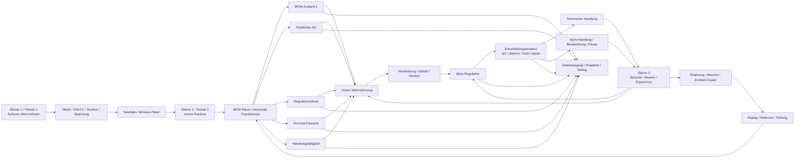

# MCM Trading Brain

MCM Trading Brain ist ein experimentelles Trading-System mit MCM-Architektur.

Ziel ist nicht ein klassischer Bot mit starren Regeln, sondern ein System, das:
- äußere Marktverhältnisse wahrnimmt
- diese intern verarbeitet
- daraus Handlungstendenzen bildet
- und sich über Erfahrung weiterentwickelt

Die Zielarchitektur orientiert sich deshalb nicht nur an einem technischen Ablauf, sondern an drei funktionalen Ebenen:
- **Ebene 1:** sehen / äußeres Wahrnehmen
- **Ebene 2:** denken / inneres Wahrnehmen / Handeln
- **Ebene 3:** Entwicklung aus Erfahrung / Verarbeitung / Wahrnehmung

---

## Grundrichtung des Systems

Die Architektur soll sich strukturell an einem menschlicheren Entscheidungs- und Wahrnehmungsprozess orientieren.

Das bedeutet:
- Außenwelt und Innenwelt sind getrennt
- äußere Reize werden nicht direkt zu Regeln oder Orders
- der innere Zustand ist nicht nur Nebenprodukt, sondern Architekturzentrum
- Erfahrung verändert langfristig Wahrnehmung, Regulation und Handlung

Das System soll nicht lernen, einfach immer weiter zu traden.
Das System soll lernen, **handlungsfähig zu bleiben**.

---

## Kernprinzip

**KI/Bot haben keine festen Gates oder starren Handelsregeln als Kernlogik.**

Das Ziel ist, dass sich Regeln, Präferenzen und regulatorische Reaktionen aus Erfahrung selbst herausbilden:
- Außenwelt erkennen: Markt, Struktur, Spannung, Bewegungscharakter
- Innenzustand verarbeiten: Druck, Konflikt, Reife, Bereitschaft, Erwartung, Regulationslast
- Trade-Versuche beobachten: auch Block, Cancel, Timeout, No-Fill, Nicht-Handlung
- Outcomes und Denkverläufe rückkoppeln
- daraus langfristig Wahrnehmung, Regulation und Handlung verändern

Dadurch soll der Bot mit der Zeit überwiegend dort handeln, wo der Kontext robust ist, statt durch harte if/else-Regeln gesteuert zu sein.

---

## Systemerweiterung

Die aktuelle Erweiterungsrichtung ist klar:

Nicht nur einzelne Signale oder Outcomes sollen bewertet werden,
sondern der **gesamte laufende Zustandsraum des MCM-Systems**.

Dazu gehört:
- explizite Wiedergabe des MCM-Raums als laufender Innenzustand
- Felddichte als Ausdruck der Verdichtung des Gesamtfeldes
- regulatorische Last als Ausdruck von innerem Druck und Instabilität
- Survival-Pressure als Rückkopplung aus Profitabilität, Drawdown, Fehlserien und Überlastung
- Handlungsfähigkeit als Ergebnis von Regulation, Erholung und Feldstabilität

Diese Größen sollen **nicht** als starre Verbote eingebaut werden.
Sie sollen aus dem MCM-Raum selbst entstehen und die Entscheidungstendenz natürlich verschieben:
- hohe Verdichtung -> mehr Beobachtung / Pause / Sammlung
- sinkender Druck -> wieder mehr tragfähige Handlung
- positive Erfahrung -> Entlastung und Stabilisierung
- Fehlhandlungen -> Verdichtung, Unsicherheit, Rückzug in Beobachtung

---

## Setup

```bash
pip install -r requirements.txt
```

Start über:

```bash
python runner.py
```

Der Modus wird in `config.py` gesetzt (`BACKTEST` oder `LIVE`).

---

## Zielarchitektur

```text
Ebene 1: sehen / äußeres Wahrnehmen
  -> OHLC/Marktdaten
  -> candle_state
  -> tension_state
  -> structure_perception_state
  -> neutrales Stimulus-/Informationspaket

Ebene 2: denken / inneres Wahrnehmen / Handeln
  -> outer_visual_perception_state
  -> inner_field_perception_state
  -> perception_state
  -> processing_state
  -> felt_state
  -> thought_state
  -> meta_regulation_state
  -> expectation_state
  -> decision tendency
  -> technische Handlung oder Nicht-Handlung

Ebene 3: Entwicklung aus Erfahrung / Verarbeitung / Wahrnehmung
  -> decision_episode
  -> review
  -> outcome_decomposition
  -> experience_space
  -> adaptive Veränderung der Innenbahn

Systemerweiterung:
  -> MCM-Raum als Gesamtzustand lesbar machen
  -> field_density / Felddichte
  -> regulatory_load / Regulationslast
  -> survival_pressure / Überlebensdruck
  -> action_readiness / Handlungsfähigkeit
```
--------------------------------------------------
## Architektur auf einen Blick


--------------------------------------------------

# --------------------------------------------------
# Ebene 1 / Thread 1
# --------------------------------------------------

## Sehen / äußeres Wahrnehmen

Diese Ebene bildet die Außenwahrnehmung.

Sie sieht den Markt, aber sie denkt nicht.
Sie erzeugt reine Informationspakete, aber keine Handelsentscheidung.

### Aufgabe

- OHLCV lesen
- Workspace / Buffer pflegen
- reine Marktinformationen berechnen:
  - Candle-State
  - Energy
  - Coherence
  - Asymmetry
  - HH
  - LL
  - Struktur
- Marktzustand neutral beschreiben
- äußere Wahrnehmung liefern
- Stimulus-/Info-Paket erzeugen
- niemals denken
- niemals entscheiden
- niemals lernen
- niemals Memory ändern
- niemals Order / Pending / Position anfassen

### Gehört dahin

- `runner.py` Feed-/Polling-Ablauf
- `csv_feed.py` / `ph_ohlcv.py` / `workspace.py` Datenpfad
- `mcm_core_engine.py` Spannungs-/Chartinfos wie Energy / Coherence / Asymmetry
- `strukture_engine.py` reine Struktur-Wahrnehmung ohne Handelsfreigabe

### Output

Nur ein neutrales Paket, zum Beispiel:

- `timestamp`
- `window_ref` oder `window_snapshot`
- `candle_state`
- `tension_state`
- `structure_perception_state`

### Wichtige Bedeutung

Diese Ebene ist das **Sehen**.

Sie ist vergleichbar mit dem äußeren Wahrnehmen eines menschlichen Traders:
- Was passiert im Chart?
- Wie ist die Struktur?
- Wie ist die Spannung?
- Wo ist Verdichtung, Ausdehnung, Druck oder Instabilität?

Aber:
- keine Deutung als Handlung
- keine Entscheidung
- keine Erfahrungsschreibung

---

# --------------------------------------------------
# Ebene 2 / Thread 2
# --------------------------------------------------

## Denken / inneres Wahrnehmen / Handeln

Diese Ebene bildet den inneren Prozess.

Hier wird der äußere Reiz nicht nur gelesen, sondern intern verarbeitet.
Hier entstehen Wahrnehmung, Gefühl, Denken, Regulation, Erwartung und daraus eine Entscheidungstendenz.

### Aufgabe

- Stimulus von Ebene 1 konsumieren
- Runtime permanent fortschreiben
- äußere Wahrnehmung intern verarbeiten
- innere Zustände bilden
- Konflikte, Reife, Unsicherheit, Bereitschaft und Regulationszustand abbilden
- Entscheidungstendenz bilden:
  - `act`
  - `observe`
  - `hold`
  - `replan`
- danach technische Handlung ausführen:
  - Pending
  - Entry
  - Position
  - Exit

### Gehört dahin

- `MCMBrainRuntime` und Runtime-Fortschreibung in `MCM_Brain_Modell.py`
- Entscheidungsbahn `build_runtime_decision_tendency(...)` / `decide_mcm_brain_entry(...)`
- Handlungsbahn in `bot.py`:
  - `_handle_active_position(...)`
  - `_handle_pending_entry(...)`
  - `_handle_entry_attempt(...)`

### Innere Zustandskette

Die innere Bahn arbeitet als gestufte Verarbeitung:

- `outer_visual_perception_state`
- `inner_field_perception_state`
- `perception_state`
- `processing_state`
- `felt_state`
- `thought_state`
- `meta_regulation_state`
- `expectation_state`
- `state_signature`

### Systemerweiterung in Ebene 2

Ebene 2 soll zusätzlich den **gesamten MCM-Raum als laufenden Zustand** lesbar machen.

Dazu gehören künftig ausdrücklich:
- **Felddichte** als Nettozustand des MCM-Feldes
- **Regulationslast** als Ausdruck innerer Verdichtung
- **Survival-Pressure** als existenzieller Druck aus Verlust, Drawdown und Fehlserien
- **Handlungsfähigkeit** als Maß, ob tragfähige Aktion aktuell besser ist als Beobachtung
- **Erholungsbedarf** als Tendenz zu Pause, Sammlung und Re-Regulation

Diese Größen sollen aus dem MCM-Raum selbst hervorgehen,
nicht als fremde starre Zusatzlogik danebenstehen.

### Wichtige Bedeutung

Diese Ebene ist nicht das reine Sehen.

Diese Ebene ist das **innere Wahrnehmen und Denken**:
- Was bedeutet der äußere Reiz für den inneren Zustand?
- Wie hoch ist Druck, Klarheit, Unsicherheit oder Reife?
- Ist Beobachtung sinnvoller als Handlung?
- Entsteht ein tragfähiger Impuls oder nur eine unreife Bewegung?
- Ist der MCM-Raum aktuell verdichtet oder reguliert?
- Ist Handeln gerade entlastend oder belastend?

Technische Handlung ist nur ein möglicher Output dieser Ebene.

Handlung ist damit nicht die Architekturmitte, sondern nur ein möglicher Ausdruck des aktuellen Innenzustands.

---

# --------------------------------------------------
# Ebene 3
# --------------------------------------------------

## Entwicklung aus Erfahrung / Verarbeitung / Wahrnehmung

Diese Ebene ist die Entwicklungsebene.

Sie speichert nicht nur Ergebnisse, sondern bewertet auch:
- wie wahrgenommen wurde
- wie verarbeitet wurde
- wie gedacht wurde
- wie gut Korrektur und Regulation waren
- wie tragfähig der innere Entscheidungsweg war
- ob Nicht-Handlung sinnvoller war als Handlung
- wie sich Felddichte, Druck und Handlungsfähigkeit verändert haben

### Aufgabe

- Experience / Episode / Review / Memory pflegen
- Nicht-Handlung dokumentieren
- Entscheidungsverlauf dokumentieren
- In-Trade-Verlauf dokumentieren
- Wahrnehmungsqualität bewerten
- Denkqualität bewerten
- Strukturtragfähigkeit bewerten
- Outcome rückkoppeln
- regulatorische Erholung und Eskalation bewerten
- langfristig verändern, wie Ebene 2 künftig wahrnimmt, verarbeitet und reguliert

### Gehört dahin

- Episoden-/Erfahrungsraum / Review / Memory in `MCM_Brain_Modell.py` und `memory_state.py`
- `mcm_decision_episode`
- `mcm_decision_episode_internal`
- `mcm_experience_space`
- `outcome_decomposition`

### Wichtige Bedeutung

Diese Ebene ist mehr als nur Speicher.

Sie ist die **Entwicklung aus Erfahrung**.

Sie verändert langfristig:
- welche äußeren Muster stärker beachtet werden
- welche inneren Zustände eher zu Beobachtung führen
- welche Denkpfade tragfähig sind
- welche Kontexte Vertrauen oder Zurückhaltung erzeugen
- wann Pause, Sammlung und Beobachtung regulatorisch wertvoller sind als Aktion

Damit wirkt Ebene 3 rückkoppelnd auf Ebene 2.

Ebene 2 denkt also nicht statisch, sondern entwickelt sich über Ebene 3 weiter.

---

# --------------------------------------------------
# Thread-Zusammenspiel
# --------------------------------------------------

## Funktionszusammenhang der Threads und Ebenen

### Thread 1

Thread 1 entspricht operativ der **Ebene 1**.

Er liefert die Außenwelt:
- Markt lesen
- Markt normalisieren
- Struktur und Spannung berechnen
- neutrales Wahrnehmungspaket erzeugen
- Paket an Thread 2 übergeben

### Thread 2

Thread 2 entspricht operativ vor allem der **Ebene 2** und teilweise der **Ebene 3**.

Er:
- konsumiert das Paket von Thread 1
- führt innere Runtime-Ticks aus
- verarbeitet Wahrnehmung und Denkvorgänge
- bildet eine Entscheidungstendenz
- führt technische Handlung aus oder handelt nicht
- aktualisiert Episode, Review und Experience-Raum
- hält den MCM-Raum fortlaufend als Innenzustand aufrecht

### Entwicklungsebene im Zusammenspiel

Die Entwicklungsebene ist kein eigener reiner Marktthread.

Sie hängt funktional am inneren Prozess und bewertet dessen Verlauf.

Das bedeutet:
- Thread 1 liefert Rohwahrnehmung
- Thread 2 verarbeitet diese intern
- die Entwicklungsebene speichert und bewertet das Ergebnis dieser Verarbeitung
- die Entwicklungsebene verändert dadurch künftig den inneren Prozess

Kurz:

```text
Thread 1
  -> sieht außen
  -> liefert neutrales Paket

Thread 2
  -> nimmt Paket innerlich auf
  -> verarbeitet / fühlt / denkt / reguliert
  -> handelt technisch oder handelt nicht
  -> hält den MCM-Raum als Zustandsraum lebendig

Entwicklungsebene
  -> bewertet Wahrnehmung + Verarbeitung + Handlung/Nicht-Handlung
  -> speichert Erfahrung
  -> verändert langfristig Thread-2-Verhalten
```

---

# --------------------------------------------------
# Harte Regel der Trennung
# --------------------------------------------------

## Thread 1 schreibt nie

Thread 1 darf niemals in innere oder handlungsbezogene Zustände schreiben.

### Thread 1 schreibt nie

- `mcm_runtime_snapshot`
- `mcm_runtime_decision_state`
- `mcm_runtime_brain_snapshot`
- `mcm_decision_episode`
- `mcm_decision_episode_internal`
- `mcm_experience_space`
- `position`
- `pending_entry`

### Grundregeln

- Thread 2 liest Chartdaten nur als Input, erzeugt aber selbst keine OHLCV-Beschaffung
- Handlung darf nur noch aus Thread 2 kommen
- Thread 1 kennt keine Orderlogik
- Thread 1 kennt keine Lernlogik
- Thread 1 kennt keine technische Positionsführung

---

# --------------------------------------------------
# Mechanische Kette der Zielarchitektur
# --------------------------------------------------

## Mechanik

Die Zielarchitektur arbeitet als Kette mit klarer Aufgabenverteilung:

```text
Markt / OHLCV
  -> äußeres Wahrnehmen
  -> neutrales Stimuluspaket
  -> inneres Wahrnehmen
  -> Verarbeitung
  -> Gefühl
  -> Denken
  -> Regulation
  -> Erwartung
  -> MCM-Raum als Zustandswiedergabe
  -> Entscheidungstendenz
  -> technische Handlung oder Nicht-Handlung
  -> Episodenbewertung
  -> Erfahrungsraum
  -> Rückwirkung auf zukünftige innere Verarbeitung
```

### Bedeutung der Kette

- Außenwelt ist Input
- Innenwelt ist Verarbeitung
- Handlung ist Output
- Entwicklung ist Rückkopplung

Damit entsteht kein starrer Signal-Bot, sondern ein fortlaufender Wahrnehmungs-, Denk- und Entwicklungsprozess.

---

# --------------------------------------------------
# MCM-Raum und Selbstregulation
# --------------------------------------------------

## MCM-Raum als Zustandsraum

Der MCM-Raum bleibt auf der Grundstruktur der Mental Core Matrix aufgebaut.

Er soll nicht durch ein fremdes Score-System ersetzt werden.
Stattdessen soll seine innere Dynamik expliziter lesbar gemacht werden.

Das bedeutet:
- nicht MCM ersetzen
- sondern MCM-Zustand explizit sichtbar machen

### Wichtige Zustandsachsen der Erweiterung

- **Felddichte**
  - Wie stark ist der MCM-Raum verdichtet?
  - Wie hoch ist die innere Ballung, Spannung oder Enge?

- **Regulationslast**
  - Wie stark ist das System gerade mit innerer Stabilisierung beschäftigt?

- **Survival-Pressure**
  - Wie stark wirkt Verlust, Drawdown, Fehlserie und Existenzdruck auf den Innenzustand?

- **Handlungsfähigkeit**
  - Ist tragfähige Aktion aktuell besser als Beobachtung?

- **Erholungsbedarf**
  - Ist Ausharren, Sammeln und Beobachten gerade sinnvoller als Eingreifen?

## Selbstregulation als Lernziel

Lernen bedeutet hier nicht nur:
- TP merken
- SL bestrafen
- Kontext speichern

Lernen bedeutet vor allem:
- den eigenen inneren Zustand regulatorisch tragfähig zu halten
- nicht in Hektik und Überverdichtung zu kippen
- Beobachtung als sinnvolle Reaktion zu erkennen
- nach Belastung wieder in Handlungsfähigkeit zurückzukommen

Der Bot soll nicht lernen, immer weiter zu versuchen.
Der Bot soll lernen, **unter Druck regulierbar zu bleiben**.

---

# --------------------------------------------------
# Struktur-Thematik
# --------------------------------------------------

## Soft-Perception statt hartem Gate

`strukture_engine.py` ist als **Soft-Perception** gedacht:
- keine feste LONG/SHORT-Entscheidung
- kein hartes Entry-Gate
- keine statische Trade-Freigabe

Die Signale wie zum Beispiel:
- `zone_proximity`
- `structure_quality`
- `structure_stability`
- `context_confidence`

sind Eingänge für die innere Verarbeitung und die spätere Entwicklung.

Struktur ist also Wahrnehmung, nicht Regel.

---

# --------------------------------------------------
# Overtrade und Selbstregulation
# --------------------------------------------------

## Overtrade & Erfahrung

Overtrade soll nicht primär über starre Verbote gelöst werden, sondern über lernbare Selbstregulation:
- Versuchsdichte vs. Outcome-Qualität
- Stress-/Druckanstieg nach Fehlserien
- Survival-Pressure bei Verlustphasen
- adaptive Zurückhaltung in schwachen Kontexten
- Beobachtung statt Zwangshandlung
- Pause und Sammlung als entlastende Zustandsveränderung

So lernt der Bot, welche Versuchsfrequenz und welche Strukturkontexte langfristig bessere Trades liefern.

---

# --------------------------------------------------
# Zielbild
# --------------------------------------------------

## Zielbild in Kurzform

### Ebene 1 / Thread 1

- außen sehen
- Markt neutral wahrnehmen
- keine Entscheidung
- kein Lernen

### Ebene 2 / Thread 2

- innerlich wahrnehmen
- verarbeiten
- denken
- regulieren
- MCM-Zustand halten
- handeln oder nicht handeln

### Ebene 3

- Erfahrung bilden
- Wahrnehmung und Verarbeitung bewerten
- Innenbahn langfristig verändern

---

## Schlussbild

Das System soll am Ende nicht nur Marktinformationen verarbeiten.

Es soll:
- **außen wahrnehmen**
- **innen verarbeiten und denken**
- **den MCM-Raum als laufenden Zustandsraum halten**
- **Selbstregulation und Überlebensfähigkeit lernen**
- **sich aus Erfahrung weiterentwickeln**

Damit ist die Zielarchitektur nicht nur eine technische Thread-Trennung, sondern eine funktionale Trennung von:
- äußerem Sehen
- innerem Wahrnehmen und Denken
- Entwicklung aus Erfahrung

Und zusätzlich eine klare Erweiterung um:
- MCM-Felddichte
- Regulationslast
- Survival-Pressure
- Handlungsfähigkeit
- Erholungsdynamik

---

## Umsetzungsplan

Der detaillierte, aktualisierte Plan liegt in:

- `UMSETZUNGSPLAN.md`
