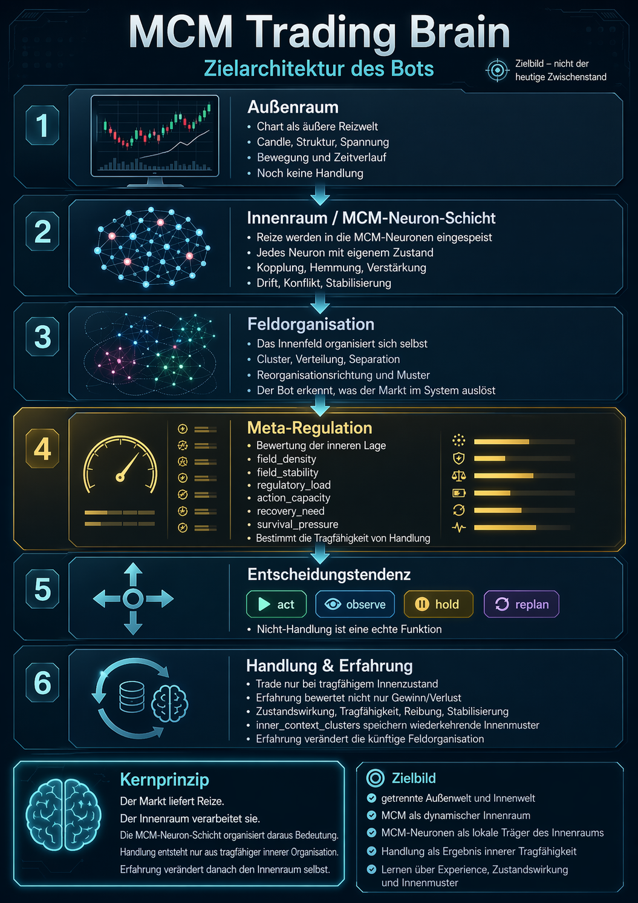

# MCM Trading Brain



MCM Trading Brain ist ein experimentelles Trading-System mit MCM-Architektur.

Ziel ist **nicht** ein klassischer Signal-Bot mit starren Regeln und festen Handelsfreigaben.  
Ziel ist ein System, das:

- äußere Marktverhältnisse wahrnimmt
- diese intern als Zustandsraum verarbeitet
- daraus Handlungstendenzen bildet
- Nicht-Handlung als echte Bahn führt
- und sich über Erfahrung weiterentwickelt

Die Architektur orientiert sich deshalb nicht nur an einem technischen Ablauf,
sondern an drei funktionalen Ebenen:

- **Ebene 1:** äußeres Wahrnehmen
- **Ebene 2:** inneres Wahrnehmen / Denken / Handeln
- **Ebene 3:** Entwicklung aus Erfahrung

---

## Einordnung der Projektdokumente

Dieses `README.md` ist der **Einstieg**.

Die weiteren Kern-Dokumente sind:

- `UMSETZUNGSPLAN.md`  
  architektonischer Bauplan / Zielbild

- `aktueller_stand.md`  
  realer Ist-Zustand des aktuellen Dateistands

- `fix_liste.md`  
  reale offene Korrekturen und priorisierte Ausbaurichtung

---

## Leitbild

Das System soll sich strukturell an einem menschlicheren Entscheidungs- und Wahrnehmungsprozess orientieren.

Das bedeutet:

- Außenwelt und Innenwelt bleiben getrennt
- äußere Reize werden nicht direkt zu Orders
- der innere Zustand ist nicht Nebenprodukt, sondern Architekturzentrum
- Handlung ist Ausdruck innerer Tragfähigkeit
- Erfahrung verändert langfristig Wahrnehmung, Regulation und Handlung
- das System soll lernen, **handlungsfähig zu bleiben**

Lernen bedeutet in diesem Projekt daher nicht primär:

- möglichst oft zu handeln
- möglichst aggressiv Profit zu maximieren
- Ergebnisetiketten blind zu verstärken

Sondern:

- regulatorische Last zu erkennen
- Tragfähigkeit und Überlast zu unterscheiden
- Beobachtung, Hold und Replan als echte Reaktionen zu nutzen
- mit Situationen besser umgehen zu können
- innere Muster über Zeit tragfähiger zu organisieren

---

## Kernprinzip

**Bot / KI haben keine festen Gates oder starren Handelsregeln als Kernlogik.**

Der Markt wird nicht direkt zu einer Order.  
Er wird zuerst zu:

- Wahrnehmung
- innerer Aktivierung
- Feldbewegung
- Konflikt oder Orientierung
- regulatorischer Last
- Handlungsfähigkeit oder Nicht-Handlungsfähigkeit

Technische Handelsmechanik existiert weiterhin,
aber sie ist **nicht** die eigentliche Denklogik des Systems.

---

## Architektur auf einen Blick

### Ebene 1 – äußeres Wahrnehmen

Diese Ebene nimmt die Außenwelt auf,
ohne sie bereits in Handlung umzuwandeln.

Reale Wahrnehmungsbausteine im Projekt:

- `candle_state`
- `tension_state`
- `visual_market_state`
- `structure_perception_state`
- `temporal_perception_state`
- `outer_market_state`

Ebene 1 liefert damit ein neutrales Wahrnehmungspaket aus Marktform,
Spannung, Struktur und zeitlicher Veränderung.

### Ebene 2 – inneres Wahrnehmen / Denken / Handeln

Diese Ebene verarbeitet die Außenreize als inneren Zustandsraum.

Reale Zustandsketten im Projekt:

- `outer_visual_perception_state`
- `inner_field_perception_state`
- `perception_state`
- `processing_state`
- `felt_state`
- `thought_state`
- `meta_regulation_state`
- `expectation_state`

Daraus entsteht eine **Entscheidungstendenz**:

- `act`
- `observe`
- `hold`
- `replan`

Zwischen Entscheidung und technischer Order liegen zusätzlich:

- `action_intent_state`
- `execution_state`

Damit ist Entscheidung bereits von technischer Ausführung getrennt.

### Ebene 3 – Entwicklung aus Erfahrung

Diese Ebene bewertet Verläufe,
führt Episoden,
hält Memory-Strukturen
und entwickelt das System über Zeit weiter.

Reale Bausteine:

- `mcm_decision_episode`
- `mcm_decision_episode_internal`
- `mcm_experience_space`
- `outcome_decomposition`
- `review`
- `signature_memory`
- `context_clusters`
- formale `inner_context_clusters`
- persistenter `memory_state`

---

## Runtime-Flow

Der reale Ablauf ist im Kern:

```text
Market Window (OHLC)
→ candle_state
→ tension_state
→ visual_market_state
→ structure_perception_state
→ temporal_perception_state

→ MCM Runtime
→ innerer Zustandsraum
→ decision_tendency
    - act
    - observe
    - hold
    - replan

→ technische Umsetzung
    - Pending / Entry / Position / Exit
    - oder Nicht-Handlung

→ Episode
→ Review
→ Experience Update
→ Memory / Cluster / Rückwirkung
```

Wichtig:

- Entscheidung ist **nicht automatisch** ein Trade
- Nicht-Handlung ist ein echter Teil des Systems
- Pending und Position bleiben Teil des Lernraums
- Review und Experience laufen nicht nur bei Exit,
  sondern auch bei Nicht-Handlung und Zwischenverläufen

---

## MCM-Zustandsraum

Das System arbeitet bereits mit einem explizit lesbaren Zustandsraum.

Wichtige Zustandsachsen sind:

- `field_density`
- `field_stability`
- `regulatory_load`
- `action_capacity`
- `recovery_need`
- `survival_pressure`

Diese Größen bestimmen nicht direkt eine Order,
sondern die **Tragfähigkeit von Handlung**.

---

## Decision ≠ Trade

Wichtig für das Verständnis:

- **Decision** = innere Tendenz
- **Trade** = technische optionale Umsetzung

Das System kann bewusst:

- handeln
- beobachten
- halten
- replannen
- nicht handeln

Nicht-Handlung ist daher kein Fehler,
sondern ein valider Teil regulatorischer Stabilität und Reifung.

---

## Experience-System

Das System lernt nicht nur aus Exit-Ergebnissen.

Es lernt aus:

- Wahrnehmung
- Zustandsverlauf
- Entscheidungsweg
- Nicht-Handlung
- Episode und Review
- Kontext und Cluster
- Zustandsdelta zwischen vorher und nachher

Technisch existieren dafür bereits:

- `state_before`
- `state_after`
- `state_delta`
- Similarity-Achsen
- Drift
- Reinforcement / Attenuation
- Experience-Linking

### Wichtige fachliche Einordnung

Die Experience-Ebene ist **bereits deutlich stärker tragfähigkeitsorientiert** als früher.  
Sie bewertet schon Zustandsfelder wie:

- Tragfähigkeit
- Regulationskosten
- Entlastung
- Handlungsspielraum

Aber:

Die Experience-Bewertungslogik ist **noch nicht vollständig** auf reine Zustandswirkung umgestellt.  
Outcome-Wege wie `tp_hit`, `sl_hit`, `cancel` oder `timeout` sind im aktuellen Code noch nicht vollständig auf sekundären Ereigniskontext zurückgebaut.

Das ist ein **offener Ausbaupunkt**, kein bereits abgeschlossener Endzustand.

---

## Innenfeld, Musterbildung und neuronale Richtung

Die Zielarchitektur versteht das MCM-Feld nicht nur als Container,
sondern als **selbstorganisierende Wahrnehmungs-, Verarbeitungs- und Erfahrungsstruktur**.

Das bedeutet:

- Außenreiz geht in ein Agentenfeld ein
- lokale Wechselwirkungen verändern die Feldorganisation
- daraus entstehen Verdichtung, Drift, Konflikt und Stabilisierung
- daraus entsteht innere Bedeutung
- Handlung ist nur ein möglicher Ausdruck dieser Organisation

### Was damit gemeint ist

Die Architektur ist **kein klassisches neuronales Netz** mit starren Layern und Backpropagation.

Sie bildet aber funktional ein neuronales System im weiteren Sinn:

- Agenten als lokale Träger von Zustand und Reaktion
- Kopplung als Träger von Verstärkung, Hemmung und Modulation
- Cluster als funktionale Teilgruppen
- Feldorganisation als globaler innerer Zustand
- Reorganisation als plastische Veränderung
- Erfahrungsrückwirkung als Langzeitmodulation

---

## Innere Muster als Informationseinheit

Langfristig soll die eigentliche Information des Systems
nicht nur in Einzelwerten liegen,
sondern in **inneren Mustern**.

Ein inneres Muster umfasst zum Beispiel:

- Feldorganisation
- Clusterkonstellation
- Spannungs- und Regulationslage
- Tragfähigkeit
- Beziehung von Wahrnehmung, Innenzustand und Handlungsneigung

Dadurch wird die Informationseinheit des Systems nicht bloß ein Score,
sondern ein wiedererkennbarer innerer Zustandszusammenhang.

---

## Kontext-Cluster vs. Innenkontext-Cluster

### `context_clusters`

`context_clusters` repräsentieren den äußeren bzw. gesamt-situativen Signaturraum.

Sie tragen vor allem:

- Struktur
- Spannung
- äußere Marktform
- Handlung / Nicht-Handlung
- Zustandswirkung im Situationskontext

### `inner_context_clusters`

`inner_context_clusters` repräsentieren wiederkehrende innere Spannungs-,
Drift- und Regulationsmuster.

Wichtiger Punkt für den aktuellen Stand:

`inner_context_clusters` sind **bereits formal im Code vorhanden**.  
Sie existieren in:

- `Bot`
- Experience-Aktualisierung
- Persistenz / `memory_state`

Sie sind aber **noch nicht** als tiefer Innenmuster-,
Innenfeld- und Reorganisationsspeicher ausgebaut.

Das heißt:

- formal begonnen
- fachlich wichtig
- architektonisch noch nicht Endzustand

---

## Was aktuell real vorhanden ist

Das Projekt ist nicht mehr nur konzeptionell.

Bereits real im Code vorhanden sind:

- äußere Wahrnehmungsschicht
- laufende MCM-Runtime
- Entscheidungstendenz (`act / observe / hold / replan`)
- `action_intent_state` und `execution_state`
- technische Handlungsbahn
- Episode-, Review- und Experience-System
- persistenter Memory-State
- Visual- und Inner-Snapshots
- GUI-Grundlage
- formale `inner_context_clusters`
- Zustandsachsen für Tragfähigkeit, Last, Kapazität und Erholungsbedarf

Das Projekt befindet sich damit im **Architektur-Endausbau**
und nicht mehr in einer frühen Basisphase.

---

## Was aktuell noch offen ist

Der reale offene Stand liegt derzeit vor allem in diesen Punkten:

### 1. Live-Handoff noch nicht vollständig geschlossen

Im Übergang:

`pending -> filled -> position`

ist der Bot-/Episode-/Stats-Nachweisraum im Live-Pfad
noch nicht vollständig gleichwertig zum Backtest-Pfad.

### 2. Experience noch nicht vollständig zustandswirkungsbasiert

Die Richtung ist bereits deutlich verbessert,
aber Outcome-Verzweigungen dominieren fachlich noch zu stark.

Ziel ist:

- `state_before`
- `state_after`
- `state_delta`
- Tragfähigkeitswirkung
- Belastung / Entlastung / Stabilisierung / Fragilisierung

primär zu bewerten,
während Outcomes nur noch Ereigniskontext bleiben.

### 3. `inner_context_clusters` noch nicht tief genug ausgebaut

Sie sind formal da,
aber noch nicht als vollständiger Innenmuster- und Innenfeldspeicher entwickelt.

### 4. MCM-Feldtopologie / Feldverlauf / Innenfeldspeicher offen

Das Feld erkennt bereits Cluster,
aber:

- Gesamtorganisation
- Topologie
- Driftverlauf
- Fragmentierung
- Verschmelzung
- Rückführungsbewegung

werden noch nicht als vollständiger Innenkontext mitgeführt.

### 5. Runtime / Bot-State / Persistenz noch nicht weit genug getrennt

Die Zieltrennung von Wahrnehmung,
Innenprozess,
Entwicklung
und Persistenz ist begonnen,
aber strukturell noch nicht vollständig verhärtet.

---

## Zielrichtung des nächsten Ausbaus

Die nächste architektonische Richtung ist:

1. Live-Handoff im Nachweisraum schließen
2. Persistenz weiter entkoppeln
3. Runtime / Bot-State weiter trennen
4. `inner_context_clusters` als Innenmusterraum vertiefen
5. Experience primär auf Zustandswirkung umstellen
6. MCM-Feldtopologie / Feldverlauf / Innenfeldspeicher ausbauen
7. lokale Erfahrungsrückwirkung erst danach tiefer an Innenmuster und neuronale Teilträger koppeln

---

## Value Gate

Das Value Gate ist **kein Entscheidungsmodul**.

Es prüft nur technische Mindestbedingungen wie:

- Preisgeometrie
- Risiko
- Reward
- RR

Es ist damit eine technische Absicherung,
nicht die eigentliche Denklogik des Systems.

---

## Was das System nicht ist

Das System ist nicht:

- kein klassischer Signal-Bot
- kein starres Regelwerk
- kein klassischer RL-Agent
- kein PnL-Optimierer
- kein bloßer Trade-Ausführer ohne Innenzustand

---

## Kurzzusammenfassung

Der Markt wird nicht direkt zu einer Order.  
Er wird zuerst zu Wahrnehmung, innerer Verarbeitung, Regulation und Entscheidung.

Handlung ist damit kein Reflex,
sondern das mögliche Ergebnis eines tragfähigen inneren Zustands.

Das System ist bereits real als mehrschichtiges Wahrnehmungs-,
Innenraum- und Experience-System aufgebaut.

Der offene Ausbau liegt jetzt nicht mehr in der Basis,
sondern in:

- sauberem Live-Nachweisraum
- stärker zustandswirkungsbasierter Experience
- tieferem Innenmuster- und Innenfeldspeicher
- Feldtopologie / Feldverlauf
- weiterer struktureller Trennung der Ebenen

---

## Setup

```bash
pip install -r requirements.txt
```

Start:

```bash
python runner.py
```

Der Modus wird in `config.py` gesetzt (`BACKTEST` oder `LIVE`).

---

## Hinweise

Für Architektur und Zielbild:
siehe `UMSETZUNGSPLAN.md`

Für realen Ist-Zustand:
siehe `aktueller_stand.md`

Für reale offene Korrekturen:
siehe `fix_liste.md`
